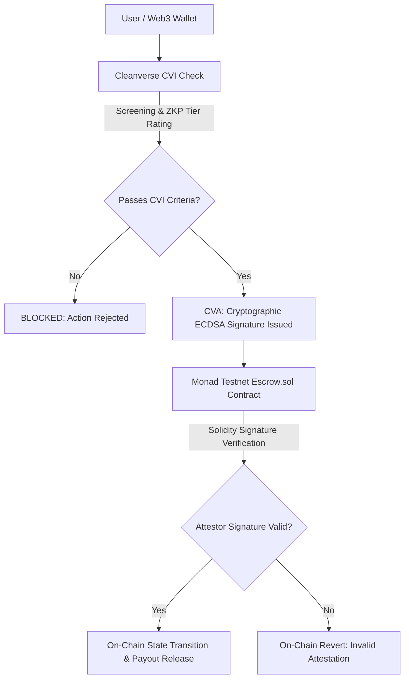
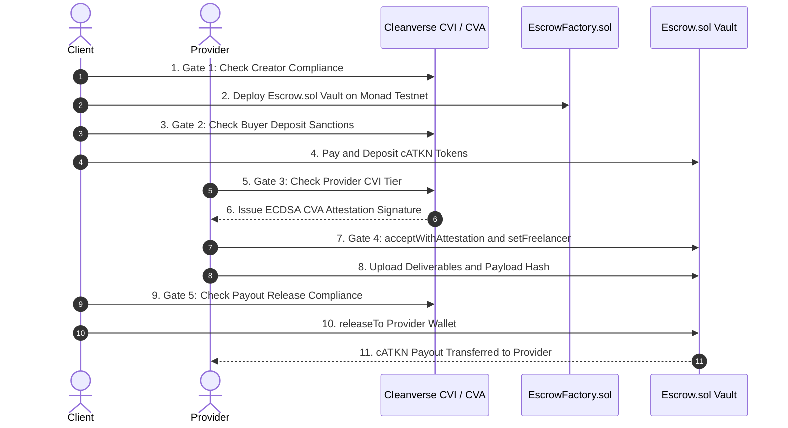

# 🛡️ VERA Protocol — Complete Project Overview
### *The Compliant On-Chain Escrow Primitive for Global Web3 Commerce*

> **Track:** Cleanverse Verified Finance Hackathon — DeFi & Infrastructure Track  
> **Network:** Monad Testnet (`Chain ID 10143`)  
> **Live Production dApp:** [`https://vera-escrow.vercel.app`](https://vera-escrow.vercel.app)  
> **GitHub Repository:** [`https://github.com/OpeyemiMoses/VERA`](https://github.com/OpeyemiMoses/VERA)

---

## 📋 Executive Summary

**VERA Protocol** is a reusable, identity-gated, compliant Web3 escrow settlement layer built natively on **Monad Testnet**. It enables buyers, sellers, freelancers, and Web3 agencies to structure, fund, and settle high-value transactions trustlessly on-chain — backed by real-time compliance screening, zero-knowledge identity gating, and cryptographic attestation proofs.

By combining the lightning-fast execution of **Monad Testnet**, the zero-knowledge identity and sanctions layer of **Cleanverse CVI (Verification Infrastructure)**, and on-chain ECDSA attestation validation via **Cleanverse CVA (Verification Attestation)**, VERA makes Web3 commerce as simple as sharing a payment link, while keeping every dollar compliant behind the scenes.

---

## 💥 The Problem Statement

Global freelancing, software auditing, and peer-to-peer Web3 commerce represent a multi-billion dollar economy. However, transactions conducted today face a severe dilemma:

1. **DM Insecurity & Counterparty Fraud:**  
   Most Web3 deals begin in direct messages on Telegram, WhatsApp, or Twitter/X. Sellers demand upfront payment; buyers fear non-delivery or exit scams.

2. **The High Cost & Friction of Web2 Escrows:**  
   Centralized platforms like Upwork or Escrow.com charge excessive platform fees (15–20%), take days to settle payouts, impose arbitrary account freezes, and require centralized database KYC.

3. **The Regulatory Risk of Anonymous Web3 Escrows:**  
   Pure anonymous smart contract escrows leave participants exposed to OFAC sanctions, money laundering (AML) liabilities, and fraudulent actors with zero identity recourse.

---

## 💡 The Solution: VERA Protocol

VERA solves this trilemma by providing a **frictionless, compliant, shareable escrow layer**:

- **Identity-Gated Smart Vaults:** Escrows are deployed as isolated smart contract vaults on Monad Testnet (`Escrow.sol`).
- **Cleanverse CVI Compliance:** Real-time sanctions geofencing, zero-knowledge A-Pass verification, and risk-tier rating before any funds are moved.
- **Cleanverse CVA Cryptographic Attestations:** ECDSA attestation signatures verified directly inside Monad Testnet smart contracts before state transitions.
- **Shareable Payment Suite:** 2x2 social share card enabling instant deal distribution via URL, QR Code, WhatsApp, or Telegram.
- **FATF Travel Rule Audit Exports:** 1-click PDF generation providing immutable proof of payment and compliance timestamps.

---

## 🏗️ Technical Architecture: CVI & CVA Integration



### 1. Cleanverse Verification Infrastructure (CVI)
**CVI** handles off-chain identity verification and risk assessment:
- **A-Pass Identity Verification:** Validates user credentials using zero-knowledge proofs (ZKP) to ensure Web3 privacy.
- **Sanctions & Regional Geofencing:** Automatically screens counterparty wallets against OFAC, EU, and custom prohibited country lists (e.g., blocking sanctioned regions).
- **Tier Rating (0–100):** Assigns compliance tiers (e.g., Tier 10, Tier 30, Tier 50) that determine deal limits, collateral requirements, and platform fee discounts.

### 2. Cleanverse Verification Attestation (CVA)
**CVA** acts as the cryptographic link to Monad Testnet smart contracts:
- **ECDSA Off-Chain Attestation:** When a user passes CVI verification, the backend Cleanverse Attestor wallet signs a cryptographic digest containing `keccak256(abi.encodePacked(escrowAddress, walletAddress, deadline))`.
- **On-Chain Solidity Verification:** Monad Testnet smart contracts (`Escrow.sol`) execute `acceptWithAttestation(bytes signature, uint256 deadline)`:
  ```solidity
  bytes32 messageHash = keccak256(abi.encodePacked(address(this), msg.sender, deadline));
  bytes32 ethSignedHash = MessageHashUtils.toEthSignedMessageHash(messageHash);
  address recoveredSigner = ethSignedHash.recover(signature);
  require(recoveredSigner == complianceAttestor, "Invalid compliance attestation signature");
  ```

---

## 🔒 The 5-Gate Escrow Lifecycle

VERA enforces **5 mandatory compliance gates** across the entire lifecycle of an escrow deal:



| # | Action Touchpoint | Enforced CVI / CVA Check | Result If Non-Compliant |
|---|---|---|---|
| **1** | **Deal Creation** | Screens creator wallet & enforces minimum tier requirements before deploying Escrow Vault contract on Monad Testnet. | **BLOCKED** — Vault deployment aborted. |
| **2** | **Escrow Funding / Deposit** | Verifies buyer identity and checks against prohibited country sanctions list before `cATKN` token deposit. | **BLOCKED** — Escrow funding rejected. |
| **3** | **Job Acceptance** | Verifies seller CVI tier and requires valid CVA ECDSA signature for on-chain `acceptWithAttestation`. | **BLOCKED** — Job acceptance rejected. |
| **4** | **Deliverable Submission** | Verifies seller CVI status and registers seller address on-chain (`setFreelancer`) before payload submission. | **BLOCKED** — Deliverable submission rejected. |
| **5** | **Payout Release** | Verifies buyer CVI status before executing `releaseTo(sellerAddress)` on Monad Testnet. | **BLOCKED** — Funds remain safely locked in Vault. |

---

## 🔥 Key Features & Capabilities

### 1. Public Service Marketplace (6 Web3 Categories)
Creators can list fixed-price Web3 services across 6 domain categories:
- 🛡️ **Smart Contract Audits**
- 💻 **Full-Stack Web3 & Frontend**
- 📈 **DeFi & Yield Protocols**
- 🔑 **ZKP & Identity Security**
- 🪙 **Tokenomics & Governance**
- 🎨 **Web3 Design & Branding**
- 📦 **Other (Custom Web3 Services & Digital Deliverables)**

*Service Capacity Limits:* Creators set total available service slots (e.g., max 5 audit slots). Claiming a slot deploys an isolated escrow contract while tracking remaining slot availability.

### 2. Private 1-on-1 Deals & 2x2 Social Share Suite
- **Unlisted Bilateral Deals:** Custom 1-on-1 deals are unlisted from the public marketplace for commercial privacy.
- **2x2 Social Share Suite:**
  - **Copy Link:** Copy payment URL to clipboard in 1 click.
  - **Show QR Code:** Renders scannable QR code modal with SVG download button.
  - **WhatsApp Direct:** Direct share button opening pre-filled WhatsApp chat.
  - **Telegram Direct:** Direct share button opening pre-filled Telegram DM chat.

### 3. Dynamic Trust-Adjusted Platform Fee Engine
Evaluates the recipient's Trust Score (0–100) to apply dynamic, trust-adjusted platform fees:
- **Low Tier (0–29):** `3.0% fee`
- **Mid Tier (30–69):** `1.5% fee`
- **High Tier (70–100):** `0.5% fee`

### 4. Transparent On-Chain Transaction Verification
All 4 escrow milestones generate transparent transaction links on the **Monad Testnet Block Explorer**:
1. `1. Deployment Tx:` Factory deployment transaction hash.
2. `2. Escrow Deposit Tx:` `cATKN` token deposit transaction hash.
3. `3. Attestation Tx:` `acceptWithAttestation` / `setFreelancer` attestation hash.
4. `4. Payout Release Tx:` `releaseTo` net payout transfer hash.

### 5. FATF Travel Rule PDF Compliance Exporter
Generates institutional-grade **FATF Travel Rule PDF Compliance Reports** containing sender/receiver wallet addresses, CVI verification scores, cryptographic transaction hashes, and Monad block timestamps for corporate accounting.

---

## 📜 Monad Testnet Smart Contracts

| Contract Name | Function & Purpose |
|---|---|
| `EscrowFactory.sol` | Factory contract that deploys isolated `Escrow.sol` vaults and tracks all deployed escrows on Monad Testnet. |
| `Escrow.sol` | Individual escrow vault holding deposited ERC-20 `cATKN` tokens, enforcing state transitions (`Funded`, `Accepted`, `Completed`, `Disputed`), and verifying Cleanverse CVA signatures. |
| `MockAToken.sol` (`cATKN`) | Monad Testnet ERC-20 compliance token used for escrow funding and settlements, featuring an integrated 10,000 token test faucet. |

---

## 🌐 Live Production Deployments

| Resource / Contract | Live Endpoint / Address | Explorer Link |
|---|---|---|
| **Live Web dApp** | [`https://vera-escrow.vercel.app`](https://vera-escrow.vercel.app) | Production Vercel Deployment |
| **EscrowFactory.sol** | `0xC06815e09263bc1E4E0d073a58F4c6ff7Eee9334` | [View on Monad Explorer](https://testnet.monadexplorer.com/address/0xC06815e09263bc1E4E0d073a58F4c6ff7Eee9334) |
| **cATKN Token (MockAToken)** | `0x505B3F7C275Ee093aB5Aa46FCe3E14467a91Ce03` | [View on Monad Explorer](https://testnet.monadexplorer.com/address/0x505B3F7C275Ee093aB5Aa46FCe3E14467a91Ce03) |
| **Cleanverse Attestor** | `0x4070E534B84cC01e62a685c96d165dEedaC39f58` | EIP-712 ECDSA Backend Signer Wallet |

---

## 💻 Tech Stack

- **Blockchain & Network:** Monad Testnet (`Chain ID 10143`, RPC `https://testnet-rpc.monad.xyz`)
- **Smart Contracts:** Solidity `0.8.20`, OpenZeppelin Contracts, Hardhat
- **Frontend Framework:** Next.js 14 (App Router), React 18, TypeScript
- **Web3 Integration:** Wagmi v2, Viem, Ethers.js v6, ConnectKit / RainbowKit
- **Styling & UI:** Vanilla CSS & TailwindCSS (Neumorphic Glass Design), Lucide Icons
- **PDF Generation:** PDF-Lib / jsPDF FATF Travel Rule PDF Generator

---

## 🚀 Quickstart & Local Installation

```bash
# 1. Clone the repository
git clone https://github.com/OpeyemiMoses/VERA.git
cd VERA/app

# 2. Install dependencies
npm install

# 3. Configure environment variables (.env.local)
NEXT_PUBLIC_CHAIN_ID=10143
NEXT_PUBLIC_RPC_URL=https://testnet-rpc.monad.xyz
NEXT_PUBLIC_FACTORY_ADDRESS=0xC06815e09263bc1E4E0d073a58F4c6ff7Eee9334
NEXT_PUBLIC_CATKN_ADDRESS=0x505B3F7C275Ee093aB5Aa46FCe3E14467a91Ce03
ATTESTOR_PRIVATE_KEY=0xb553cb10a16d0ce4a890cf2611922db0b572fd91ea4b11a56735f179b4b53516

# 4. Launch the local development server
npm run dev
# Open http://localhost:3005 in your browser
```

---

> [!NOTE]
> **Built with ❤️ for the Cleanverse Verified Finance Hackathon on Monad Testnet.**
