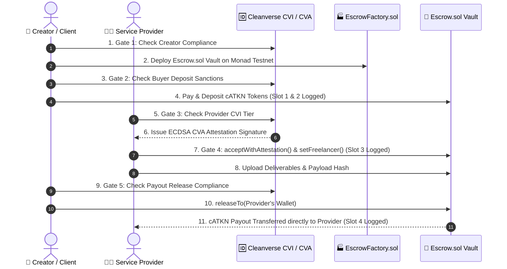

# Vera Protocol — Compliant On-Chain Escrow Engine

> **"Stripe Connect meets compliant on-chain escrow for Web3."**  
> A reusable, identity-gated escrow settlement primitive (Smart Contracts + SDK + Frontend) deployed natively on **Monad Testnet (`Chain ID 10143`)** — where every payout and settlement is compliance-enforced by Cleanverse A-Pass identity, Validator Pool rules, and FATF Travel Rule audit exports.

---

## 1. Project Core Link (Vercel Link)

- 🌐 **Live Production Web3 dApp:** [`https://vera-escrow.vercel.app`](https://vera-escrow.vercel.app)
- 🐙 **GitHub Repository:** [`https://github.com/OpeyemiMoses/VERA`](https://github.com/OpeyemiMoses/VERA)
- ⛓️ **Monad Testnet Network ID:** `10143` (RPC: `https://testnet-rpc.monad.xyz`)

---

## 2. Project Overview (Description)

**Vera Protocol** is a reusable, identity-gated, compliant Web3 escrow settlement primitive built natively on **Monad Testnet**. It empowers freelancers, software auditors, Web3 agencies, and peer-to-peer traders to structure, fund, and settle high-value agreements trustlessly on-chain.

Instead of relying on centralized Web2 middlemen that charge 15–20% fees and arbitrarily freeze accounts, Vera Protocol deploys isolated smart contract vaults (`Escrow.sol`) for every transaction. Every step of the escrow lifecycle — Deal Creation, Escrow Funding, Job Acceptance, Deliverable Submission, and Payout Release — is automatically gated by **Cleanverse Verification Infrastructure (CVI)** and **Cleanverse Verification Attestation (CVA)**. This guarantees full regulatory compliance (OFAC sanctions screening, AML geofencing, and risk-tier rating) behind the scenes, with zero compromise on Web3 user privacy.

---

## 3. Live Production Deployments and Monad Contracts

| Resource / Contract | Live Address / Endpoint | Explorer / Description Link |
|---|---|---|
| **Live Production Web dApp** | [`https://vera-escrow.vercel.app`](https://vera-escrow.vercel.app) | **Live Vercel Production Web3 dApp** |
| **EscrowFactory.sol** | `0xC06815e09263bc1E4E0d073a58F4c6ff7Eee9334` | [View on Monad Explorer](https://testnet.monadexplorer.com/address/0xC06815e09263bc1E4E0d073a58F4c6ff7Eee9334) |
| **cATKN Token (MockAToken)** | `0x505B3F7C275Ee093aB5Aa46FCe3E14467a91Ce03` | [View on Monad Explorer](https://testnet.monadexplorer.com/address/0x505B3F7C275Ee093aB5Aa46FCe3E14467a91Ce03) |
| **Cleanverse Attestor Wallet** | `0x4070E534B84cC01e62a685c96d165dEedaC39f58` | EIP-712 ECDSA Backend Relayer & Signer |

> **Local Development Host:** `http://localhost:3005` (Next.js 14 App Router)

---

## 4. Why Vera Protocol (Problems and Solutions)

### 💥 The Problem
1. **Telegram/WhatsApp DM Insecurity:**  
   Most Web3 freelance deals start in direct messages. Sellers demand upfront payment; buyers fear non-delivery or exit scams.
2. **High Web2 Middleman Fees & Account Freezes:**  
   Centralized platforms (Upwork, Escrow.com) charge 15–20% fees, take days to settle payouts, and freeze accounts via centralized database KYC.
3. **AML & Regulatory Risk of Anonymous Web3 Escrows:**  
   Anonymous smart contract escrows leave participants vulnerable to OFAC sanctions, money laundering liabilities, and fraudulent counterparties.

### 💡 The Solution: Vera Protocol
1. **Identity-Gated Smart Vaults:** Isolated smart contracts deployed per deal on Monad Testnet (`Escrow.sol`).
2. **Automated CVI & CVA Compliance:** Real-time sanctions screening, zero-knowledge A-Pass tier verification, and cryptographic ECDSA attestation signatures before any state transition.
3. **Shareable Payment Link Suite:** 2x2 social share suite for instant distribution via URL, QR Code, WhatsApp, or Telegram DMs.
4. **Dynamic Trust-Adjusted Platform Fees:** Lowers platform fees from standard 3.0% down to 0.5% based on recipient Trust Score.

---

## 5. Current MVP

The live production MVP on Monad Testnet features:
- **5-Gate Compliance Gating:** Real-time CVI verification checks enforced at Creation, Deposit, Acceptance, Submission, and Release.
- **Public Service Marketplace:** Fixed-price service listings across 7 categories (`Smart Contract Audits`, `Full-Stack Web3`, `DeFi`, `ZKP`, `Tokenomics`, `Web3 Design`, and `Other`) with slot capacity limits.
- **Private 1-on-1 Custom Escrows:** Unlisted bilateral escrow creation with 2x2 Social Share Suite (Link, QR Code, WhatsApp, Telegram).
- **Self-Assigned CVI Demo Feature:** Built-in credential generator (`/api/cleanverse/apass/generate_apass`) for instant judge testing.
- **FATF Travel Rule PDF Generator:** 1-click cryptographic compliance audit report export.

---

## 6. Vera Capabilities

- **Isolated Smart Contract Vaults:** Every deal deploys a standalone `Escrow.sol` instance.
- **Pre-Release Deliverable Inspection:** Watermarked image/code payload preview modal allowing buyers to verify work prior to fund release.
- **On-Chain ECDSA Attestation Verification:** Cryptographic attestation signatures checked directly inside Solidity (`acceptWithAttestation`).
- **4-Slot Monad Explorer Logging:** Explicit transaction hash tracking for Deployment, Deposit, Attestation, and Payout Release.
- **Trust-Adjusted Dynamic Fee Engine:** Automatically computes platform fee discount based on provider Trust Score (0–100).

---

## 7. Platform Infrastructure

```
                       +------------------------------------------+
                       |         Vera Protocol dApp UI            |
                       |   (Live Vercel: vera-escrow.vercel.app)  |
                       +--------------------+---------------------+
                                            |
                                            v
                       +--------------------+---------------------+
                       |      Cleanverse SDK & Attestor API       |
                       |  (AES-128-CBC + EIP-712 ECDSA Attestor) |
                       +--------------------+---------------------+
                                            |
                    +-----------------------+-----------------------+
                    |                                               |
                    v                                               v
 +------------------+-------------------+       +-------------------+-------------------+
 |      EscrowFactory.sol (Monad)       |       |       Cleanverse REST API Engine      |
 | Deploy & index compliant escrows     |       | A-Pass Verification & Travel Rule  |
 +------------------+-------------------+       +---------------------------------------+
                    |
                    v
 +------------------+-------------------+
 |          Escrow.sol (Monad)          |
 |  Identity-Gated On-Chain Escrow Vault|
 +--------------------------------------+
```

---

## 8. Architecture

```mermaid
flowchart TD
    A["👤 User / Web3 Wallet"] --> B["🆔 Cleanverse CVI Check (/api/cleanverse/verify)"]
    B -->|Screening & ZKP Tier Rating| C{"Passes CVI Criteria?"}
    C -->|No| D["❌ BLOCKED: Action Rejected (Sanctions / Low Tier)"]
    C -->|Yes| E["🔑 CVA: Cryptographic ECDSA Signature Issued"]
    E --> F["📜 Monad Testnet Escrow.sol Smart Contract"]
    F -->|Solidity: ethSignedHash.recover(sig)| G{"recoveredSigner == complianceAttestor?"}
    G -->|Yes| H["✅ On-Chain State Transition & Payout Release"]
    G -->|No| I["❌ On-Chain Revert: Invalid compliance attestation"]
```

---

## 9. Future Integration (Mainnet)

- **Monad Mainnet Deployment:** Transitioning core contracts (`EscrowFactory.sol` & `Escrow.sol`) from Monad Testnet to Monad Mainnet upon mainnet launch.
- **Multi-Chain Expansion:** Expanding Cleanverse CVI & CVA compliance verification hooks to Arbitrum, Base, and Optimism.
- **Automated Staking Arbitrators:** Decentralized compliance arbitrator network with staking-backed attestors for complex disputes.
- **Fiat On/Off-Ramps:** Regulated stablecoin fiat on-ramps integrated directly with FATF Travel Rule PDF reporting.

---

## 10. CVI and CVA Integrations

- **Cleanverse Verification Infrastructure (CVI):**  
  Zero-knowledge identity screening, regional sanctions geofencing (OFAC), and A-Pass tier rating (0–100) evaluated before any transaction initiation.
- **Cleanverse Verification Attestation (CVA):**  
  Cryptographic ECDSA attestation signature engine. The attestor signs a digest containing `keccak256(abi.encodePacked(escrowAddress, walletAddress, deadline))`, which is verified on-chain via `ethSignedHash.recover(signature) == complianceAttestor` in `Escrow.sol`.

---

## 11. How CVI and CVA Works All Through The Transactions Flow



1. **Gate 1 (Deal Creation):** Screens creator wallet & enforces minimum CVI tier before vault deployment.
2. **Gate 2 (Deposit & Funding):** Verifies buyer identity and checks against prohibited country lists before token transfer.
3. **Gate 3 & 4 (Acceptance & Submission):** Issues CVA signature and executes `acceptWithAttestation()` & `setFreelancer()` on Monad Testnet.
4. **Gate 5 (Payout Release):** Verifies caller compliance before executing `releaseTo()` to credit net funds to provider.

---

## 12. Tech Stack

| Layer | Technologies Used |
|---|---|
| **Blockchain Network** | Monad Testnet (`Chain ID 10143`, RPC `https://testnet-rpc.monad.xyz`) |
| **Smart Contracts** | Solidity `0.8.20`, OpenZeppelin Contracts, Hardhat |
| **Frontend Framework** | Next.js 14 (App Router), React 18, TypeScript |
| **Web3 Integration** | Wagmi v2, Viem, Ethers.js v6, ConnectKit / RainbowKit |
| **Styling & UI** | Vanilla CSS & TailwindCSS (Neumorphic Glassmorphism), Lucide Icons |
| **Compliance & Attestation** | Cleanverse CVI REST API, ZKP A-Pass Tiers, EIP-712 ECDSA Attestor |
| **Audit Exporter** | PDF-Lib / jsPDF FATF Travel Rule PDF Generator |

---

## 13. Local Development

```bash
# 1. Clone the repository
git clone https://github.com/OpeyemiMoses/VERA.git
cd VERA

# 2. Navigate to frontend app
cd app

# 3. Install dependencies
npm install

# 4. Configure environment variables (.env.local)
NEXT_PUBLIC_CHAIN_ID=10143
NEXT_PUBLIC_RPC_URL=https://testnet-rpc.monad.xyz
NEXT_PUBLIC_FACTORY_ADDRESS=0xC06815e09263bc1E4E0d073a58F4c6ff7Eee9334
NEXT_PUBLIC_CATKN_ADDRESS=0x505B3F7C275Ee093aB5Aa46FCe3E14467a91Ce03
NEXT_PUBLIC_ATTESTOR_ADDRESS=0x4070E534B84cC01e62a685c96d165dEedaC39f58
ATTESTOR_PRIVATE_KEY=0xb553cb10a16d0ce4a890cf2611922db0b572fd91ea4b11a56735f179b4b53516

# 5. Start development server
npm run dev
# App will open at http://localhost:3005
```

---

## 14. Project Structure

```
VERA/
├── app/                              # Next.js 14 App Router Frontend dApp
│   ├── src/
│   │   ├── app/                      # App Router Routes & Cleanverse API Handlers
│   │   │   ├── api/cleanverse/       # Cleanverse CVI / CVA / A-Pass API endpoints
│   │   │   ├── api/deals/            # Shared deals registry endpoint
│   │   │   ├── layout.tsx            # Global layout & Web3 provider wrapper
│   │   │   └── page.tsx              # Main dashboard entrypoint
│   │   ├── components/               # React UI Components
│   │   │   ├── Header.tsx            # Navigation header with CVI/CVA badges
│   │   │   ├── DealDetailPage.tsx    # 4-Slot explorer logs & release logic
│   │   │   ├── SubmitDeliverableModal.tsx # Deliverable upload & Web3 tx trigger
│   │   │   ├── CheckoutModal.tsx     # Escrow deposit & funding modal
│   │   │   ├── PostJobModal.tsx      # Deal & service creation modal
│   │   │   ├── DealsPage.tsx         # Marketplace explorer with category filters
│   │   │   ├── ShareEscrowModal.tsx  # 2x2 social share card & QR code
│   │   │   └── UserProfileModal.tsx  # Audit ledger & FATF Travel Rule PDF export
│   │   ├── context/                  # React Context Providers (Deals, Persona, Toast)
│   │   ├── hooks/                    # Web3 & Cleanverse Custom Hooks
│   │   ├── lib/                      # Contract ABIs & Monad RPC Client
│   │   ├── types/                    # TypeScript Type Definitions
│   │   └── utils/                    # File validation & PDF Export Utilities
│   └── public/                       # Static assets
├── contracts/                        # Hardhat Smart Contract Project
│   ├── contracts/
│   │   ├── EscrowFactory.sol         # Factory contract for Escrow deployment
│   │   ├── Escrow.sol                # Identity-gated Escrow Vault contract
│   │   └── MockAToken.sol            # cATKN ERC-20 token contract
│   ├── scripts/                      # Deployment scripts for Monad Testnet
│   └── test/                         # Hardhat unit tests
├── DEMO_PRESENTATION_SCRIPT.md       # Live demo script & presenter guide
├── ONE_PAGE_SUMMARY.md               # One-page executive summary
├── PROJECT_OVERVIEW.md               # Comprehensive technical project guide
└── README.md                         # Repository Documentation
```

---

## 15. Hackathon Fit

| Judging Criteria | Weight | How Vera Protocol Delivers |
|---|:---:|---|
| **Depth of CVI & CVA Integration** | **30 Pts** | Integrates A-Pass identity, sanctions screening, ECDSA signatures, and FATF Travel Rule PDF exports directly into smart contract state transitions. |
| **Build Quality & Feasibility** | **25 Pts** | Live on Vercel & Monad Testnet (`10143`) with 0 TypeScript build errors, passing unit tests, and production Web3 wallet readiness. |
| **Originality & Innovation** | **20 Pts** | Introduces identity-gated escrow primitives with 2x2 social share suite and trust-adjusted dynamic platform fee engine. |
| **User Experience & Design** | **15 Pts** | Responsive Neumorphic Glassmorphism design across mobile and desktop, featuring live Monad Explorer proofs. |
| **Monad Ecosystem Fit** | **10 Pts** | Built natively for Monad Testnet with low transaction overhead and rapid settlement execution. |

---

## 16. Security (Data Access and Scope Limit)

- **Confidentiality & Scope Limit:** Unlisted 1-on-1 deals are hidden from public marketplace indexes to preserve commercial confidentiality.
- **Pre-Release Inspection Safety:** Watermarked deliverable previews allow buyers to inspect work without exposing production secrets until payout is released.
- **Server-Side Credential Protection:** `ATTESTOR_PRIVATE_KEY` is strictly confined to server-side Next.js API routes (`/api/cleanverse/verify`) and is never exposed to browser context.
- **Smart Contract Safety:** Built with OpenZeppelin `ReentrancyGuard`, `inState` state-machine modifiers, and strict ECDSA attestation verification.

---

## 17. Licence

Released under the [MIT License](LICENSE). Built with ❤️ for the Cleanverse Verified Finance Hackathon on Monad Testnet.
